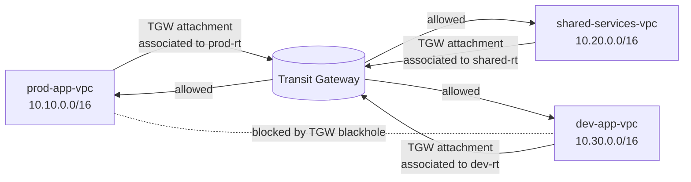

# AWS Transit Gateway Segmentation Routing Lab

Terraform lab for studying AWS Transit Gateway route tables, VPC attachments, route table associations, route propagation, and segmented reachability.

This lab builds three VPCs in one AWS Region:

- `prod-app-vpc`
- `shared-services-vpc`
- `dev-app-vpc`

Transit Gateway is used as the routing hub. The design allows:

- `prod` to reach `shared-services`
- `dev` to reach `shared-services`
- `shared-services` to reach both `prod` and `dev`
- `prod` and `dev` to remain isolated from each other

The important part is that the isolation is visible in the Transit Gateway route tables. The `prod` and `dev` TGW route tables include explicit blackhole routes for the opposite application VPC.

## Architecture



## What You Study

- Why TGW route table association decides which TGW route table an attachment uses.
- Why propagation is not the same thing as association.
- How VPC route tables and TGW route tables must both agree for traffic to work.
- How to use explicit blackhole routes for segmentation.
- How to validate routing with private EC2 instances managed by SSM.
- How to explain TGW segmentation without mixing it with Cloud WAN or Route 53.

## Folder Layout

```text
.
├── docs/
│   ├── architecture.md
│   ├── cost-notes.md
│   ├── deployment-runbook.md
│   ├── manual-console-steps.md
│   ├── screenshot-checklist.md
│   ├── study-guide.md
│   ├── tgw-routing-deep-dive.md
│   └── validation-matrix.md
├── examples/
│   ├── ssm-validation-commands.md
│   └── terraform.tfvars.example
├── scripts/
│   ├── destroy.ps1
│   └── validate-ssm.ps1
└── terraform/
    ├── main.tf
    ├── outputs.tf
    ├── variables.tf
    └── versions.tf
```

## Quick Start

```bash
cd terraform
terraform init
terraform plan -out plan.out
terraform apply plan.out
```

After deployment, use the output named `ssm_validation_commands` to test allowed and blocked paths through AWS Systems Manager Run Command.

Destroy it when done:

```bash
terraform destroy
```

## Cost Notes

The default deployment uses:

- One Transit Gateway.
- Three TGW VPC attachments.
- Three small EC2 instances.
- Private SSM interface endpoints in each VPC.

It avoids NAT Gateways and public IPs. The cost should be low for a short study window, but destroy it after validation.

See [docs/deployment-runbook.md](docs/deployment-runbook.md) and [docs/validation-matrix.md](docs/validation-matrix.md).
